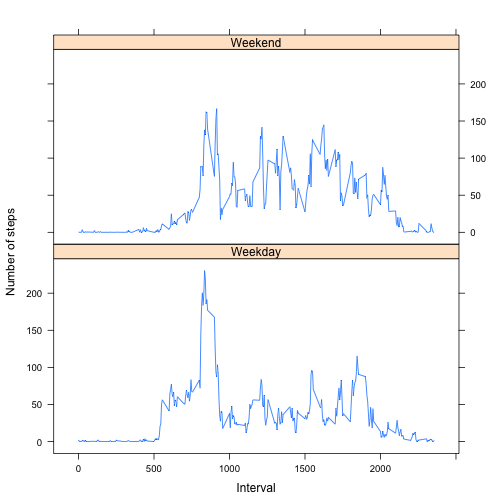

## Loading and preprocessing the data
1. Downloading the data set and unzip it

```r
download.file("https://d396qusza40orc.cloudfront.net/repdata%2Fdata%2Factivity.zip",
               destfile = "PA1.zip",
               method = "curl"
               )
unzip("PA1.zip")
raw <- read.csv("activity.csv")
```
2. Converting raw data from data.frame to data.table for later processing

```r
library("data.table")
raw <- data.table(raw)
```


## What is mean total number of steps taken per day?
1. Sum up total number of steps each day, and calculate the mean and median at 
   the same time. The resultant data will be shown in the html file.

```r
plotdata1 <- raw[, list(sum=sum(steps, na.rm=TRUE), mean=mean(steps, na.rm=TRUE), 
                     median=as.double(median(steps, na.rm=TRUE))), by=date]
print(plotdata1)
```

```
##           date   sum       mean median
##  1: 2012-10-01     0        NaN     NA
##  2: 2012-10-02   126  0.4375000      0
##  3: 2012-10-03 11352 39.4166667      0
##  4: 2012-10-04 12116 42.0694444      0
##  5: 2012-10-05 13294 46.1597222      0
##  6: 2012-10-06 15420 53.5416667      0
##  7: 2012-10-07 11015 38.2465278      0
##  8: 2012-10-08     0        NaN     NA
##  9: 2012-10-09 12811 44.4826389      0
## 10: 2012-10-10  9900 34.3750000      0
## 11: 2012-10-11 10304 35.7777778      0
## 12: 2012-10-12 17382 60.3541667      0
## 13: 2012-10-13 12426 43.1458333      0
## 14: 2012-10-14 15098 52.4236111      0
## 15: 2012-10-15 10139 35.2048611      0
## 16: 2012-10-16 15084 52.3750000      0
## 17: 2012-10-17 13452 46.7083333      0
## 18: 2012-10-18 10056 34.9166667      0
## 19: 2012-10-19 11829 41.0729167      0
## 20: 2012-10-20 10395 36.0937500      0
## 21: 2012-10-21  8821 30.6284722      0
## 22: 2012-10-22 13460 46.7361111      0
## 23: 2012-10-23  8918 30.9652778      0
## 24: 2012-10-24  8355 29.0104167      0
## 25: 2012-10-25  2492  8.6527778      0
## 26: 2012-10-26  6778 23.5347222      0
## 27: 2012-10-27 10119 35.1354167      0
## 28: 2012-10-28 11458 39.7847222      0
## 29: 2012-10-29  5018 17.4236111      0
## 30: 2012-10-30  9819 34.0937500      0
## 31: 2012-10-31 15414 53.5208333      0
## 32: 2012-11-01     0        NaN     NA
## 33: 2012-11-02 10600 36.8055556      0
## 34: 2012-11-03 10571 36.7048611      0
## 35: 2012-11-04     0        NaN     NA
## 36: 2012-11-05 10439 36.2465278      0
## 37: 2012-11-06  8334 28.9375000      0
## 38: 2012-11-07 12883 44.7326389      0
## 39: 2012-11-08  3219 11.1770833      0
## 40: 2012-11-09     0        NaN     NA
## 41: 2012-11-10     0        NaN     NA
## 42: 2012-11-11 12608 43.7777778      0
## 43: 2012-11-12 10765 37.3784722      0
## 44: 2012-11-13  7336 25.4722222      0
## 45: 2012-11-14     0        NaN     NA
## 46: 2012-11-15    41  0.1423611      0
## 47: 2012-11-16  5441 18.8923611      0
## 48: 2012-11-17 14339 49.7881944      0
## 49: 2012-11-18 15110 52.4652778      0
## 50: 2012-11-19  8841 30.6979167      0
## 51: 2012-11-20  4472 15.5277778      0
## 52: 2012-11-21 12787 44.3993056      0
## 53: 2012-11-22 20427 70.9270833      0
## 54: 2012-11-23 21194 73.5902778      0
## 55: 2012-11-24 14478 50.2708333      0
## 56: 2012-11-25 11834 41.0902778      0
## 57: 2012-11-26 11162 38.7569444      0
## 58: 2012-11-27 13646 47.3819444      0
## 59: 2012-11-28 10183 35.3576389      0
## 60: 2012-11-29  7047 24.4687500      0
## 61: 2012-11-30     0        NaN     NA
##           date   sum       mean median
```

2. Plot a histogram based on the total number of steps in each day

```r
hist(plotdata1$sum, xlab="Sum of steps", ylab="Frequency",
     main="Histogram of daily total number of steps before proccessing all NA")
```

 

## What is the average daily activity pattern?
1. First of all summarize the daily steps by taking the average across all 
   days for each interval. The resultant data will be shown.

```r
plotdata2 <- raw[, list(sum=sum(steps, na.rm=TRUE),
                        average=mean(steps, na.rm=TRUE)), by=interval]
print(plotdata2)
```

```
##      interval sum   average
##   1:        0  91 1.7169811
##   2:        5  18 0.3396226
##   3:       10   7 0.1320755
##   4:       15   8 0.1509434
##   5:       20   4 0.0754717
##  ---                       
## 284:     2335 249 4.6981132
## 285:     2340 175 3.3018868
## 286:     2345  34 0.6415094
## 287:     2350  12 0.2264151
## 288:     2355  57 1.0754717
```

2. Make a line plot with x-axis being the interval and y-axis being average steps

```r
plot(plotdata2$interval, plotdata2$average, type="l",
     xlab="Interval of the day", ylab="Average steps across all days",
     main="Daily Activity Pattern")
```

 

3. Find the interval with the max number of steps across all days

```r
peak <- plotdata2[plotdata2$average == max(plotdata2$average),]
print(peak)
```

```
##    interval   sum  average
## 1:      835 10927 206.1698
```
On average, number of steps reach the peak at **interval 835** with
average **206.1698113 steps**


## Imputing missing values
1. Compute the total numbers of rows with missing steps

```r
total <- nrow(raw[is.na(raw$steps)])
print(total)
```

```
## [1] 2304
```
Uh-ha, there are **2304** rows with missing data

2. Fill up the missing data with mean for that 5 minute interval

```r
## Using a for loop in this way is actually a bad idea as it's significantly slow
## If not for the requirement for a new data set equal to the original one, I
## would have used merge function to do this which is faster but changes the format
## of the dataset a bit.
newraw <- raw
newraw$steps <- as.double(newraw$steps) ##prevent data truncation from double to int
n <- nrow(newraw)
for(i in 1:n) {
   if (is.na(newraw$steps[i])) {
      newraw$steps[i] <- plotdata2[plotdata2$interval==newraw$interval[i],]$average
   }
}
```

3. Prepare plot data and generate a new histogram

```r
plotdata3 <- newraw[, list(sum=sum(steps), mean=mean(steps), 
                     median=as.double(median(steps))), by=date]
print(plotdata3)
```

```
##           date      sum       mean   median
##  1: 2012-10-01 10766.19 37.3825996 34.11321
##  2: 2012-10-02   126.00  0.4375000  0.00000
##  3: 2012-10-03 11352.00 39.4166667  0.00000
##  4: 2012-10-04 12116.00 42.0694444  0.00000
##  5: 2012-10-05 13294.00 46.1597222  0.00000
##  6: 2012-10-06 15420.00 53.5416667  0.00000
##  7: 2012-10-07 11015.00 38.2465278  0.00000
##  8: 2012-10-08 10766.19 37.3825996 34.11321
##  9: 2012-10-09 12811.00 44.4826389  0.00000
## 10: 2012-10-10  9900.00 34.3750000  0.00000
## 11: 2012-10-11 10304.00 35.7777778  0.00000
## 12: 2012-10-12 17382.00 60.3541667  0.00000
## 13: 2012-10-13 12426.00 43.1458333  0.00000
## 14: 2012-10-14 15098.00 52.4236111  0.00000
## 15: 2012-10-15 10139.00 35.2048611  0.00000
## 16: 2012-10-16 15084.00 52.3750000  0.00000
## 17: 2012-10-17 13452.00 46.7083333  0.00000
## 18: 2012-10-18 10056.00 34.9166667  0.00000
## 19: 2012-10-19 11829.00 41.0729167  0.00000
## 20: 2012-10-20 10395.00 36.0937500  0.00000
## 21: 2012-10-21  8821.00 30.6284722  0.00000
## 22: 2012-10-22 13460.00 46.7361111  0.00000
## 23: 2012-10-23  8918.00 30.9652778  0.00000
## 24: 2012-10-24  8355.00 29.0104167  0.00000
## 25: 2012-10-25  2492.00  8.6527778  0.00000
## 26: 2012-10-26  6778.00 23.5347222  0.00000
## 27: 2012-10-27 10119.00 35.1354167  0.00000
## 28: 2012-10-28 11458.00 39.7847222  0.00000
## 29: 2012-10-29  5018.00 17.4236111  0.00000
## 30: 2012-10-30  9819.00 34.0937500  0.00000
## 31: 2012-10-31 15414.00 53.5208333  0.00000
## 32: 2012-11-01 10766.19 37.3825996 34.11321
## 33: 2012-11-02 10600.00 36.8055556  0.00000
## 34: 2012-11-03 10571.00 36.7048611  0.00000
## 35: 2012-11-04 10766.19 37.3825996 34.11321
## 36: 2012-11-05 10439.00 36.2465278  0.00000
## 37: 2012-11-06  8334.00 28.9375000  0.00000
## 38: 2012-11-07 12883.00 44.7326389  0.00000
## 39: 2012-11-08  3219.00 11.1770833  0.00000
## 40: 2012-11-09 10766.19 37.3825996 34.11321
## 41: 2012-11-10 10766.19 37.3825996 34.11321
## 42: 2012-11-11 12608.00 43.7777778  0.00000
## 43: 2012-11-12 10765.00 37.3784722  0.00000
## 44: 2012-11-13  7336.00 25.4722222  0.00000
## 45: 2012-11-14 10766.19 37.3825996 34.11321
## 46: 2012-11-15    41.00  0.1423611  0.00000
## 47: 2012-11-16  5441.00 18.8923611  0.00000
## 48: 2012-11-17 14339.00 49.7881944  0.00000
## 49: 2012-11-18 15110.00 52.4652778  0.00000
## 50: 2012-11-19  8841.00 30.6979167  0.00000
## 51: 2012-11-20  4472.00 15.5277778  0.00000
## 52: 2012-11-21 12787.00 44.3993056  0.00000
## 53: 2012-11-22 20427.00 70.9270833  0.00000
## 54: 2012-11-23 21194.00 73.5902778  0.00000
## 55: 2012-11-24 14478.00 50.2708333  0.00000
## 56: 2012-11-25 11834.00 41.0902778  0.00000
## 57: 2012-11-26 11162.00 38.7569444  0.00000
## 58: 2012-11-27 13646.00 47.3819444  0.00000
## 59: 2012-11-28 10183.00 35.3576389  0.00000
## 60: 2012-11-29  7047.00 24.4687500  0.00000
## 61: 2012-11-30 10766.19 37.3825996 34.11321
##           date      sum       mean   median
```

```r
hist(plotdata3$sum, xlab="Sum of steps", ylab="Frequency",
     main="Histogram of daily total number of steps after proccessing all NA")
```

 
The resultant plot and data do differ from the original ones before inputing all
missing data. However, the difference is many on those days when steps are 
missing. For days having valid step data, there is essentially no change.


## Are there differences in activity patterns between weekdays and weekends?
1. Create a new column called 'wd' from the initial 'date' column, and append 
the new column to the dataset. Convert the initial date in format "%Y-%m-%d" 
into dates and derive the "Weekday" and "Weekend" factors.

```r
wd <- newraw$date
names(wd) <- "wd"
newraw <- cbind(newraw, wd)
newraw$wd <- weekdays(as.Date(newraw$wd, format="%Y-%m-%d"))
newraw[(newraw$wd=="Saturday" | newraw$wd=="Sunday"),]$wd <- "Weekend"
newraw[(newraw$wd=="Monday" | newraw$wd=="Tuesday" | newraw$wd=="Wednesday" |
        newraw$wd=="Thursday" | newraw$wd=="Friday"),]$wd <- "Weekday"

newraw$wd <- as.factor(newraw$wd)
```
2. Generating the Weekday Vs Weekend line charts

```r
library(lattice)
plotdata4 <- newraw[,list(sum=sum(steps), average=mean(steps)), by=list(wd, interval)]
xyplot(average ~ interval | wd, data = plotdata4, type = "l", layout = c(1,2),
       as.Table = TRUE, xlab = "Interval", ylab = "Number of steps")
```

 
